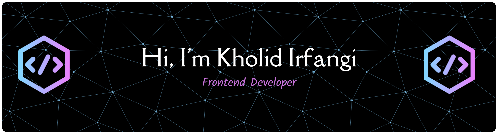

Self-taught frontend developer from Indonesia.
I build clean, fast, and visually appealing websites —
especially for local businesses and UMKM who want to go digital.

**Currently open for:** freelance projects & full-time/remote opportunities
📩 kholidirfangi394@gmail.com · responds within 24 hours

---

## What I build

- Modern, responsive websites with **Next.js** + **TypeScript** + **Tailwind CSS**
- Smooth, interactive UI using **Framer Motion**
- Fullstack features with **Supabase** — auth, database, storage
- Digital presence for local businesses: landing pages, company profiles, web apps

---

## Tech Stack

  
  
  
  
  
  
  
  
  
  
  
  
  
  
 

---

## GitHub Stats

  
  

## Play With Me

<picture>
  <source media="(prefers-color-scheme: dark)" srcset="https://raw.githubusercontent.com/kholidirfangi/kholidirfangi/output/snake-dark.svg">
  <source media="(prefers-color-scheme: light)" srcset="https://raw.githubusercontent.com/kholidirfangi/kholidirfangi/output/snake.svg">
  
</picture>
---

## Find me

